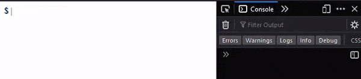

# Terminal Emulator





Inspired by .

---
- [CDN](#cdn)
- [Instalation](#instalation)
- [Example usage](#example-usage)
- [Options](#options)
- [Methods](#methods)
- [React](#react)
- [Do's and dont's](#dos-and-donts)

## CDN

You can use the CDN version for simple imports in HTML:

```html
<script src="https://unpkg.com/unix-terminal-emulator@latest/dist/index.js"></script>
```

## Instalation

You can install it via your prefered package manager:

```shell
npm i --save unix-terminal-emulator
```
```shell
yarn add unix-terminal-emulator
```

## Example usage

For more advanced examples, please see the [examples folder](https://github.com/LucEnden/unix-terminal-emulator/examples).

```javascript
import UnixTerminalEmulator from "unix-terminal-emulator"

const terminal = new UnixTerminalEmulator()
const command = {
	text: "echo Hello, World!",
	writeSpeed: "neutral",
	output: "Hello, World!",
	pauseBeforeOutput: 500,
}
terminal.addCommand(command).run()
```

## Options

| Name | Type | Default value | Description |
|---|:---:|---|---|
| wrapperId | ``string`` or ``undefined`` | ``"terminal___emulator___wrapper"`` | The HTML id of the element to which the text should be written. Must be unique. If the element does not exist one will be created and appended to the body at the end. |
| wrapperClassName | ``string`` or ``undefined`` | ``"terminal___emulator___wrapper"`` | The CSS class to give to the wrapper element. |
| cursor | ``string`` or ``undefined`` | ``"\|"`` | The character(s) to use as the cursor inside the terminal. |
| cursorId | ``string`` or ``undefined`` | ``"terminal___emulator___cursor"`` | The HTML id of the element which functions as the terminal cursor. Must be unique. The element will always be created on initialization.The HTML id of the element which functions as the terminal cursor. Must be unique. The element will always be created on initialization. |
| cursorClassName | ``string`` or ``undefined`` | ``"terminal___emulator___cursor"`` | The CSS class to give to the cursor element. Note: if the animation property is set within the CSS class, it will overwrite the cursor blinking animation. |
| cursorAnimation | ``"fluid"`` or ``"static"`` or ``undefined`` | ``"static"`` | The type of animation to give to the cursor.   Fluid = the opacity oscillates between 0 and 100.   Static = the cursor blinks (like it does in a real unix terminal).   Undefined = no animation is applied. |
| enviroment | ``{ hostname, username }`` or ``undefined`` | ``undefined`` | When defined, everytime a new input line gets added to the terminal, it will prepend a unix like enviroment text to the start of the new line. **For example**: <br></br>`` enviroment: undefined => "$ "; enviroment: { hostname: "localhost", username: "root" } => "root@localhost:$ ";`` |

## Methods

| Name | Params | Description |
|---|---|---|
| run | ``callback: () => void \| undefined`` Gets called when the sequence has finished | Excecutes the created event sequence |
| addCommand | ``command: TerminalCommand`` The command to add to the queue | Adds a command to the to queue. |
| addCommands | ``commands: TerminalCommand[]`` The commands to add to the queue | Adds multiple commands to the to queue. |
| pause | ``ms: number`` The time to pause for in miliseconds | Adds a pause in the event sequence. |
| echo |  |  |
| touch |  |  |
| mkdir |  |  |
| history |  |  |
| clear |  |  |
| vim |  |  |

## React

T.B.A.

## Do's and dont's

Below are a few examples of do's and dont's regarding building a command sequence.

```javascript
const terminal = new UnixTerminalEmulator();
```

:heavy_check_mark: Chain the commands you want to run in sequence before calling run (this is by design):
```javascript
// Chaining commands is by design
terminal
    .addCommand({ text: "echo foo", writeSpeed: "neutral", output: "foo", pauseBeforeOutput: 500 })
    .pause(1000)
    .addCommand({ text: "echo bar", writeSpeed: "neutral", output: "bar", pauseBeforeOutput: 500 })
    .run()
```

:heavy_check_mark: Call the sequence building commands in a non-chain fashion, as long as the run method is called last (this is by design):
```javascript
terminal.addCommand({ text: "echo foo", writeSpeed: "neutral", output: "foo", pauseBeforeOutput: 500 })
terminal.pause(1000)
terminal.addCommand({ text: "echo bar", writeSpeed: "neutral", output: "bar", pauseBeforeOutput: 500 })
terminal.run()
```

:warning: Adding commands to the sequence BEFORE run has finished will queue them for the current sequence.
```javascript
terminal
    .addCommand({ text: "echo foo", writeSpeed: "neutral", output: "foo", pauseBeforeOutput: 500 })
    .run()
// The command added bellow will be added to the current sequence
terminal.addCommand({ text: "echo bar", writeSpeed: "neutral", output: "bar", pauseBeforeOutput: 500 })
// The command bellow in the setTimeout will not run in the first sequence, a new call to the run method is required in order to run it
setTimeout(() => {
    terminal.addCommand({ text: "echo baz", writeSpeed: "neutral", output: "baz", pauseBeforeOutput: 500 })
}, 10000)
```

:x: Calling the run method on a terminal instance before the previous call has finished will result in unexpected behaviour
```javascript
terminal
    .addCommand({ text: "echo foo", writeSpeed: "neutral", output: "foo", pauseBeforeOutput: 500 })
    .addCommand({ text: "echo bar", writeSpeed: "neutral", output: "bar", pauseBeforeOutput: 500 })
    .run()
terminal.run() // this brakes the sequence and will result in unexpected behaviour
```