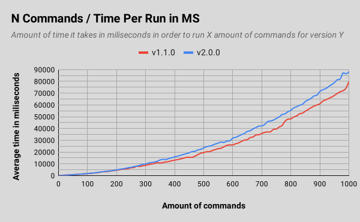
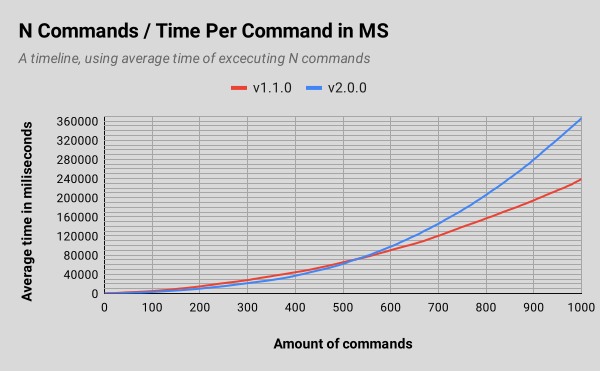
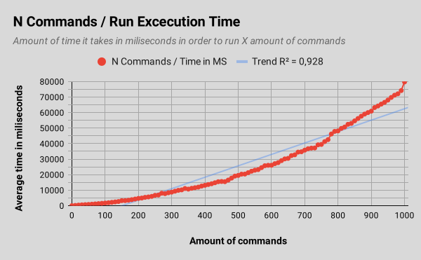
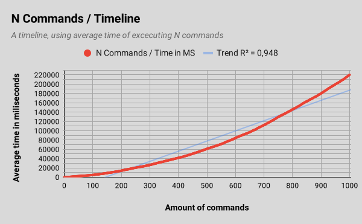

# Terminal Emulator


 -


Inspired by .

---

- [CDN](#cdn)
- [Instalation](#instalation)
- [Example usage](#example-usage)
- [Options](#options)
- [Methods](#methods)
- [Interfaces](#interfaces)
- [React](#react)
- [Do's and dont's](#dos-and-donts)
- [Perfomance](#perfomance)
	- [N Commands / Time Per Run](#n-commands--time-per-run)
	- [N Commands / Time Per Command](#n-commands--time-per-command)
	- [Implementations:](#implementations)

## CDN

You can use the CDN version for simple imports in HTML:

```html
<script src="https://unpkg.com/unix-terminal-emulator@latest/dist/index.js"></script>
```

## Instalation

You can install it via your prefered package manager:

```shell
npm i --save unix-terminal-emulator
```

```shell
yarn add unix-terminal-emulator
```

## Example usage

For more advanced examples, please click [this link](https://codesandbox.io/s/unix-terminal-emulator-example-5n9ylu?file=index.html).

```javascript
import UnixTerminalEmulator from "unix-terminal-emulator"

const terminal = new UnixTerminalEmulator()
const command = {
	text: "echo Hello, World!",
	writeSpeed: "neutral",
	output: "Hello, World!",
	pauseBeforeOutput: 500,
}
terminal.addCommand(command).run()
```

## Options

| Name             | Type                                    | Default value                     | Description                                                                                                                                                                                                                                                                                |
| ---------------- | :-------------------------------------- | --------------------------------- | ------------------------------------------------------------------------------------------------------------------------------------------------------------------------------------------------------------------------------------------------------------------------------------------ |
| wrapperId        | `string` or `undefined`                 | `"terminal___emulator___wrapper"` | The HTML id of the element to which the text should be written. Must be unique. If the element does not exist one will be created and appended to the body at the end.                                                                                                                     |
| wrapperClassName | `string` or `undefined`                 | `"terminal___emulator___wrapper"` | The CSS class to give to the wrapper element.                                                                                                                                                                                                                                              |
| cursor           | `string` or `undefined`                 | `"\|"`                            | The character(s) to use as the cursor inside the terminal.                                                                                                                                                                                                                                 |
| cursorId         | `string` or `undefined`                 | `"terminal___emulator___cursor"`  | The HTML id of the element which functions as the terminal cursor. Must be unique. The element will always be created on initialization.The HTML id of the element which functions as the terminal cursor. Must be unique. The element will always be created on initialization.           |
| cursorClassName  | `string` or `undefined`                 | `"terminal___emulator___cursor"`  | The CSS class to give to the cursor element. Note: if the animation property is set within the CSS class, it will overwrite the cursor blinking animation.                                                                                                                                 |
| cursorAnimation  | `"fluid"` or `"static"` or `undefined`  | `"static"`                        | The type of animation to give to the cursor. Fluid = the opacity oscillates between 0 and 100. Static = the cursor blinks (like it does in a real unix terminal). Undefined = no animation is applied.                                                                                     |
| enviroment       | `{ hostname, username }` or `undefined` | `undefined`                       | When defined, everytime a new input line gets added to the terminal, it will prepend a unix like enviroment text to the start of the new line. **For example**: <br></br>` enviroment: undefined => "$ "; enviroment: { hostname: "localhost", username: "root" } => "root@localhost:$ ";` |

## Methods

| Name        | Params                                                                                                                                                                                                                                                                                                         | Description                             |
| ----------- | -------------------------------------------------------------------------------------------------------------------------------------------------------------------------------------------------------------------------------------------------------------------------------------------------------------- | --------------------------------------- |
| run         | `callback: () => void \| undefined` Gets called when the sequence has finished                                                                                                                                                                                                                                 | Excecutes the created event sequence    |
| addCommand  | `command: TerminalCommand` The command to add to the queue                                                                                                                                                                                                                                                     | Adds a command to the to queue.         |
| addCommands | `commands: TerminalCommand[]` The commands to add to the queue                                                                                                                                                                                                                                                 | Adds multiple commands to the to queue. |
| pause       | `ms: number` The time to pause for in miliseconds                                                                                                                                                                                                                                                              | Adds a pause in the event sequence.     |
| echo        | `text: string` The text to echo, `writeSpeed: "neutral" \| number = "neutral"` The speed at which to write each character of the command, `pauseBeforeOutput: number \| undefined = undefined` The time to pause before writing the output in miliseconds                                                      | Emulates the echo command.              |
| history     | `writeSpeed: "neutral" \| number = "neutral"` The speed at which to write each character of the command, `pauseBeforeOutput: number \| undefined = undefined` The time to pause before writing the output in miliseconds                                                                                       | Emulates the history command.           |
| clear       | `writeSpeed: "neutral" \| number = "neutral"` The speed at which to write each character of the command, `pauseBeforeOutput: number \| undefined = undefined` The time to pause before writing the output in miliseconds                                                                                       | Emulates the clear command.             |
| mkdir       | `dirNames: string` A space delimited string containing all the directories to create, `writeSpeed: "neutral" \| number = "neutral"` The speed at which to write each character of the command, `pauseBeforeOutput: number \| undefined = undefined` The time to pause before writing the output in miliseconds |

## Interfaces

T.B.A.

## React

T.B.A.

## Do's and dont's

Below are a few examples of do's and dont's regarding building a command sequence.

```javascript
const terminal = new UnixTerminalEmulator()
```

---

:heavy_check_mark: Chain the commands you want to run in sequence before calling run (this is by design):

```javascript
// Chaining commands is by design
terminal
	.addCommand({
		text: "echo foo",
		writeSpeed: "neutral",
		output: "foo",
		pauseBeforeOutput: 500,
	})
	.pause(1000)
	.addCommand({
		text: "echo bar",
		writeSpeed: "neutral",
		output: "bar",
		pauseBeforeOutput: 500,
	})
	.run()
```

---

:heavy_check_mark: Call the sequence building commands in a non-chain fashion, as long as the run method is called last (this is by design):

```javascript
terminal.addCommand({
	text: "echo foo",
	writeSpeed: "neutral",
	output: "foo",
	pauseBeforeOutput: 500,
})
terminal.pause(1000)
terminal.addCommand({
	text: "echo bar",
	writeSpeed: "neutral",
	output: "bar",
	pauseBeforeOutput: 500,
})
terminal.run()
```

---

:warning: Adding commands to the sequence BEFORE run has finished will queue them for the current sequence (this is timing depentend and not recomended).

```javascript
terminal
	.addCommand({
		text: "echo foo",
		writeSpeed: "neutral",
		output: "foo",
		pauseBeforeOutput: 500,
	})
	.run()
// The command added bellow will be added to the current sequence
terminal.addCommand({
	text: "echo bar",
	writeSpeed: "neutral",
	output: "bar",
	pauseBeforeOutput: 500,
})
// The command bellow in the setTimeout will not run in the first sequence, a new call to the run method is required in order to run it
setTimeout(() => {
	terminal.addCommand({
		text: "echo baz",
		writeSpeed: "neutral",
		output: "baz",
		pauseBeforeOutput: 500,
	})
}, 10000)
```

---

:x: Calling the run method on a terminal instance before the previous call has finished will result in unexpected behaviour

```javascript
terminal
	.addCommand({
		text: "echo foo",
		writeSpeed: "neutral",
		output: "foo",
		pauseBeforeOutput: 500,
	})
	.addCommand({
		text: "echo bar",
		writeSpeed: "neutral",
		output: "bar",
		pauseBeforeOutput: 500,
	})
	.run()
terminal.run() // this brakes the sequence and will result in unexpected behaviour
```

---

:x: Creating 2 terminal instances with the same wrapper and cursor ID will result in unexpected behaviour

```javascript
const terminal1 = new UnixTerminalEmulator({
	wrapperId: "same-wrapper-id",
	cursorId: "same-cursor-id",
})
const terminal2 = new UnixTerminalEmulator({
	wrapperId: "same-wrapper-id",
	cursorId: "same-cursor-id",
})
terminal1
	.addCommand({
		text: "echo foo",
		writeSpeed: "neutral",
		output: "foo",
		pauseBeforeOutput: 500,
	})
	.run()
terminal2
	.addCommand({
		text: "echo foo",
		writeSpeed: "neutral",
		output: "foo",
		pauseBeforeOutput: 500,
	})
	.run()
```

## Perfomance

| Time per Run in MS                                                                    | Time per Command in MS                                                                    |
| ------------------------------------------------------------------------------------- | ----------------------------------------------------------------------------------------- |
|  |  |

[Click here](https://docs.google.com/spreadsheets/d/e/2PACX-1vSAKSUTB6fm6-PQNgSEpBtxe9h_v1m2JiYnl--0hHiyvHMK8Yrdz16e5Y8X9kPmBm0HvIJPgchSufp4/pubhtml) to see an interactive version of the graph.

Bellow are performance charts based on different versions of the app, including explenation about how the performance was measured.

### N Commands / Time Per Run

Ive created an in browser performance test for the run method. What it does is as follows:

-   Add N ammount of commands to a terminal instance T, where N starts at 0
-   Get the average excecution time for running N commands 10 times
-   After running N commands 10 times, N += 10
-   Repeat until N amount of commands exceeds 1000

This will allow me to plot a line graph showing the average excecution time of running N ammount of commands using the run method.

The pseudo code for this is:

```
maxN_commands = 1000
X = 1
N = 0
averageMetrics = []

while (N < maxN_commands):
    terminal = new UnixTerminalEmulator()
    // add N amount of commands
    for (i = 0, i < N, i++):
        terminal.addCommand({ text: "foo", writeSpeed: 0 })

    metrics = []
    // run N amount of commands 10 times
    while (X < 10):
        metricStart = new Date()
        terminal.run()
        metricEnd = new Date()
        metric = metricEnd - metricStart
        metrics.push(metric)
        i++

    averageMetrics.push(metrics.average())
    N += 10

averageMetrics.plot()
```

### N Commands / Time Per Command

As for time per individual command, ive implemented the following in browser performance test:

-   Add N ammount of commands to a terminal instance T, where N = 1000
-   Run N ammount of commands X times, where X = 10
-   Get the average excecution time per command for N commands X times

This will allow me to plot a timeline graph showing the average time has passed after each command.

The pseudo code for this is:

```
X = 10
N = 1000
I = 0
averageMetrics = []

while (I < X):
    terminal = new UnixTerminalEmulator()
    // add N amount of commands
    for (i = 0, i < maxN_commands, i++):
        terminal.addCommand({ text: "foo", writeSpeed: 0, output: () => {
			var exeTime = new Date().getTime().toString()
		} })

    metrics = [new Date().getTime()]
	terminal.run()
	var metric = <get the terminal content as text and parse it to json, resulting in an array of numbers representing time after each command was excecuted>
	metrics.push(metric)
    averageMetrics.push(metrics.average())

averageMetrics.plot()
```

### Implementations:

-   [Implementation of measering time per run for N commands](./tests/performance/nCommands_timePerRun.html)
-   [Implementation of measering time per command for N commands](./tests/performance/nCommands_timePerCommand.html)

<details>
<summary>Version 1</summary>





</details>
